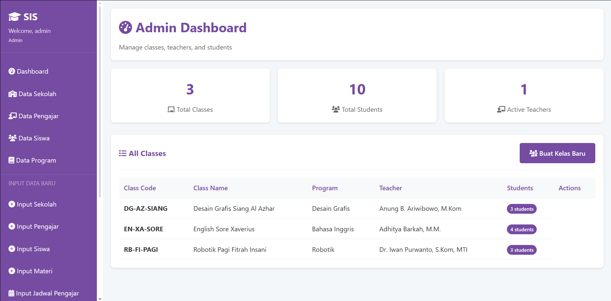
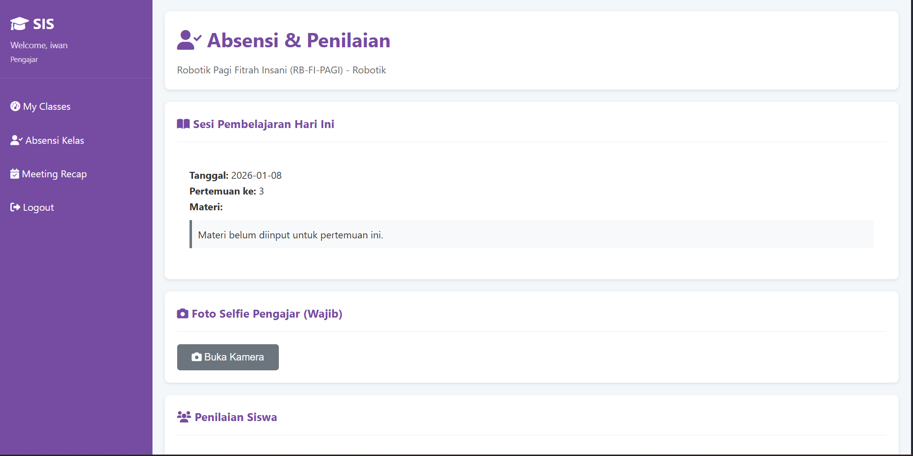
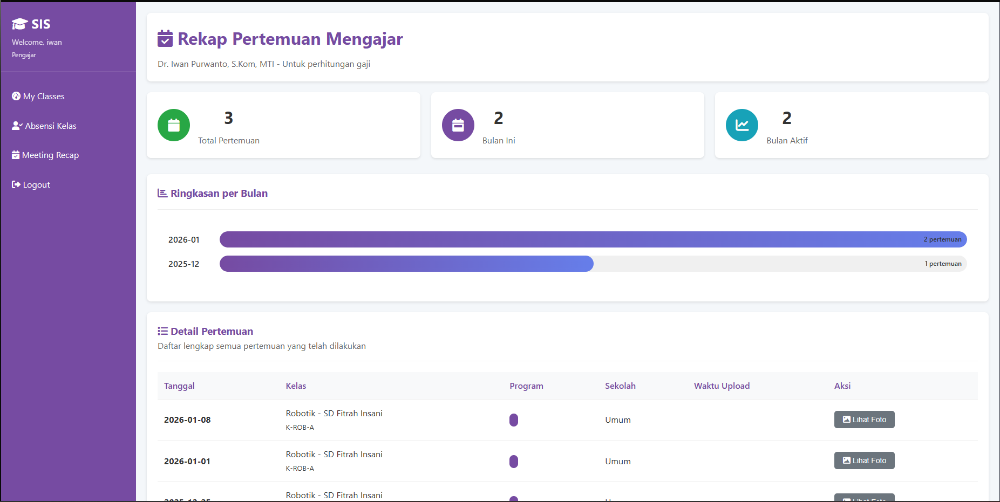
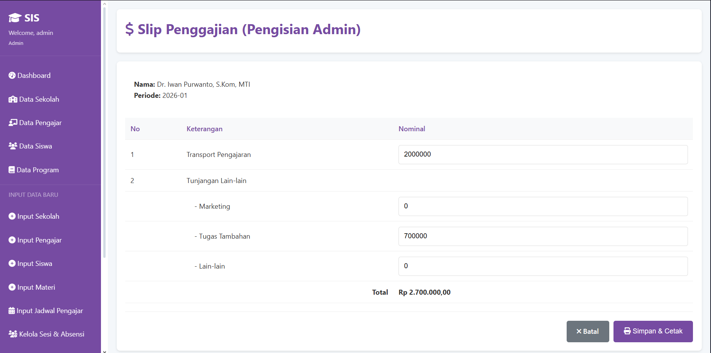

# SIS (School Information System)


*(Admin Dashboard: Pusat kontrol manajemen sekolah)*

Sistem Informasi Sekolah berbasis web yang dibangun dengan **Python Flask**. Proyek ini dirancang untuk memanajemen kegiatan belajar mengajar (KBM) secara *end-to-end* pada lembaga pendidikan non-formal (Les/Kursus). Sistem menangani validasi kehadiran berbasis biometrik (foto), manajemen akademik, hingga otomatisasi penggajian.

## 🚀 Fitur Unggulan (Highlights)

### 1. Absensi & Validasi (Teacher)
Menggunakan **HTML5 Camera API & Canvas** untuk menangkap bukti kehadiran (selfie) secara real-time. Sistem memvalidasi hari dan jam mengajar sebelum mengizinkan absensi masuk.


*(Antarmuka absensi dengan preview kamera aktif & validasi lokasi/waktu)*

### 2. Meeting Recap & Analytics (Teacher)
Pengajar memiliki dashboard analitik untuk memantau performa mengajar mereka sendiri.
* **Statistik Bulanan:** Visualisasi jumlah pertemuan bulan ini vs total pertemuan.
* **Riwayat Mengajar:** List detail kelas yang sudah diajar beserta bukti fotonya.


*(Dashboard statistik performa pengajar)*

### 3. Payroll Automation (Admin)
Sistem penggajian otomatis yang mengeliminasi perhitungan manual.
* **Auto-Calculate:** Gaji pokok, transport, dan tunjangan dihitung berdasarkan jumlah sesi kehadiran yang terekam di database.
* **Slip Gaji Digital:** Admin dapat mencetak slip gaji resmi dalam format siap cetak.


*(Form kalkulasi gaji otomatis dengan JavaScript)*

---

## 📋 Daftar Fitur Lengkap

Selain fitur unggulan di atas, aplikasi ini mencakup modul manajemen yang komprehensif:

### 🛠️ Modul Administrator
* **Master Data Management:** CRUD (Create, Read, Update, Delete) untuk data Sekolah, Pengajar, Siswa, dan Program Belajar.
* **Bulk Import System:** Fitur upload data massal (Siswa/Pengajar) menggunakan file **CSV**, mempercepat proses input data awal.
* **Class Grouping Logic:** Manajemen pembagian kelas dan kelompok belajar (Grouping) dengan validasi kuota per kelas.
* **Session Management:**
    * *Manual Session Input:* Menangani kasus guru pengganti atau kelas tambahan di luar jadwal.
    * *Achievement Settings:* Mengatur target capaian pembelajaran (milestone) untuk setiap level program.
* **Jadwal Pelajaran:** Plotting jadwal (Hari/Jam) untuk setiap kelas guna validasi absensi otomatis.

### 👨‍🏫 Modul Pengajar (Teacher)
* **Real-time Attendance:** Absensi siswa per sesi dengan status (Hadir/Sakit/Izin).
* **Student Assessment:** Input nilai karakter siswa (Kedisiplinan, Kreativitas, Kerjasama) setiap pertemuan.
* **Teaching Evidence:** Upload bukti materi dan foto kegiatan.

### 👨‍🎓 Modul Siswa (Student)
* **Digital Portfolio:** Siswa/Wali murid dapat melihat rekap perkembangan belajar.
* **Monthly Report:** Laporan bulanan otomatis yang merangkum kehadiran dan catatan khusus dari pengajar.

### 🔐 Keamanan & Sistem
* **Role-Based Access Control (RBAC):** Pemisahan hak akses ketat antara Admin, Pengajar, dan Siswa.
* **Secure Authentication:** Password hashing menggunakan standar industri (Werkzeug Security).
* **Sanitized Inputs:** Perlindungan dasar terhadap SQL Injection pada input form.

---

## 🛠️ Tech Stack
* **Backend:** Python 3, Flask (Microframework)
* **Database:** SQLite (Native SQL queries untuk optimasi performa)
* **Frontend:** HTML5, CSS3, JavaScript (DOM Manipulation, Camera API, Modal Logic)
* **Templating:** Jinja2

## 📦 Cara Menjalankan (Localhost)

1.  **Clone repository**
    ```bash
    git clone [https://github.com/felixpalingan/sis-website.git](https://github.com/felixpalingan/sis-website.git)
    cd sis-website
    ```

2.  **Install Dependencies**
    ```bash
    pip install -r requirements.txt
    ```

3.  **Setup Database**
    Jalankan script inisialisasi untuk membuat tabel dan data dummy:
    ```bash
    python database.py
    ```

4.  **Jalankan Aplikasi**
    ```bash
    python app.py
    ```
    Akses di browser: `http://localhost:5000`

## 🔑 Akun Demo

| Role | Username | Password |
| :--- | :--- | :--- |
| **Admin** | `admin` | `admin123` |
| **Pengajar** | `iwan` | `teacher123` |
| **Siswa** | `dewanto` | `student123` |

---
